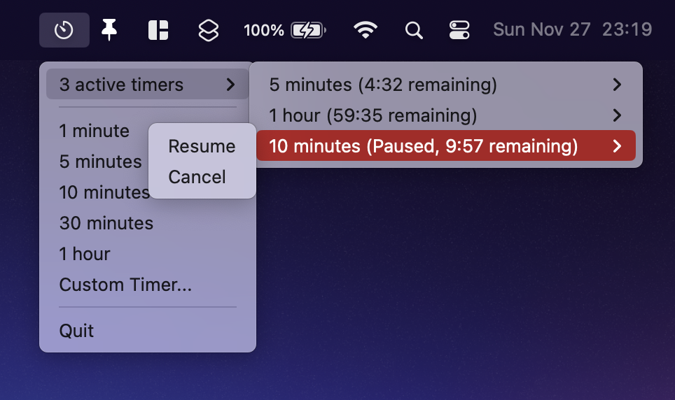
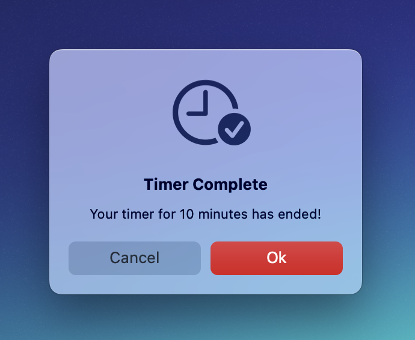

# MultiTimer
A macOS menubar app for running multiple timers simultaneously. Created in Python with PyXA.

## Images
The menubar dropdown:


When a timer completes:


## Install
Download `MultiTimer.zip` from the [releases page](https://github.com/helloimsteven/multitimer/releases), unzip it, and move the application bundle to the Applications Folder. Since the app is unsigned, you will need to right-click the application bundle and select "Open" to run the app for the first time.

## Run via Python
To run MultiTimer via Python, use Python 3.10 or higher and install the required packages via pip:

```
$ pip install mac-pyxa py2app
```

Then simply run the Python script as you normally would:

```
$ python MultiTimer.py
```

##   Build
To build an application bundle for macOS, use `py2app`. A `setup.py` file is provided, but you may wish to customize it.

To install `py2app`:

```
$ python setup.py py2app -A
```

To bundle the app:

```
$ python setup.py py2app
```